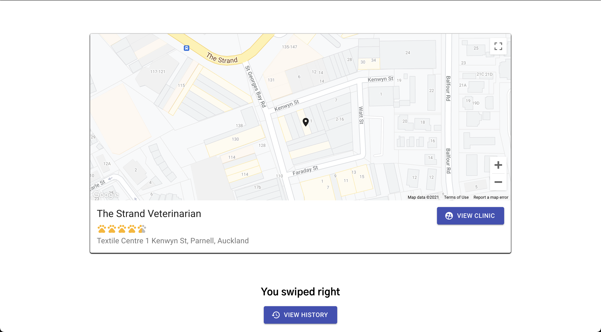

[![Contributors][contributors-shield]][contributors-url]
[![Issues][issues-shield]][issues-url]

<!-- PROJECT LOGO -->
<br />

<p align="center">
    
  </a>

  <h3 align="center">ezySwiper</h3>

  <p align="center">
      Find your next vet. Tinder style.
    <br />
  </p>

</p>


<!-- TABLE OF CONTENTS -->
<details open="open">
  <summary>Table of Contents</summary>
  <ol>
    <li>
      <a href="#about-the-project">About The Project</a>
    </li>
    <li>
      <a href="#getting-started">Getting Started</a>
      <ul>
        <li><a href="#prerequisites">Prerequisites</a></li>
        <li><a href="#installation">Installation</a></li>
      </ul>
    </li>
    <li><a href="#contributing">Contributing</a></li>
    <li><a href="#license">License</a></li>
    <li><a href="#hackathon contribution">Hackathon Contribution</a></li>
  </ol>
</details>


<!-- ABOUT THE PROJECT -->
## About The Project

<p align="center">
    

  </a>is a tinder-style web app designed to help pet-lovers find the ideal practice to care for their animal companions. The website prompts users to swipe left or right on a displayed veterinary office to indicate if it fails to meet or surpasses their needs.  

<!-- GETTING STARTED -->
## Getting Started

To get a local copy up and running follow these simple example steps.

### Prerequisites

You should have any terminal and Node.js (tested with 14.16.1).

### Installation

1. Clone the repo
   ```sh
   git clone https://github.com/ChalzZy/vet-swiper
   ```
   
2. In terminal `cd ./frontend` and type `node install`

3. `npm start`

4.  In terminal `cd .. `and `cd ./backend` type `node install`

5. `node server.js`

6. Open http://localhost:3000/

<!-- CONTRIBUTING -->

## Contributing

Contributions are what make the open source community such an amazing place to be learn, inspire, and create. Any contributions you make are **greatly appreciated**.

1. Fork the Project
2. Create your Feature Branch (`git checkout -b feature/AmazingFeature`)
3. Commit your Changes (`git commit -m 'Add some AmazingFeature'`)
4. Push to the Branch (`git push origin feature/AmazingFeature`)
5. Open a Pull Request


<!-- LICENSE -->
## License

Distributed under the MIT License.


<!-- Hackathon Contribution -->

## Hackathon Contribution

Charles Monaghan

- Importing given JSON into MongoDB
- Created API to get all vet practices and return only vets who work there
- Created JS scripts to find distance, ratings, and pet types

Harpreet Singh

* Majority of react frontend visuals
* Manipulated data from API requests
* Got swiping feature completed

Dakota Sargent

- Research for the project
- Wrote readme
- Completed presentation slides
- Design of the project